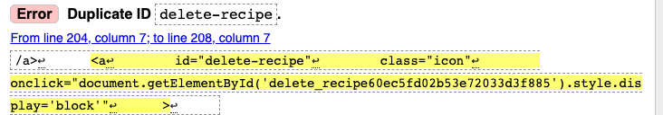
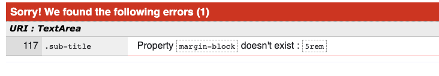
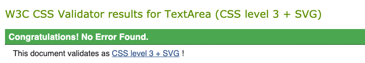
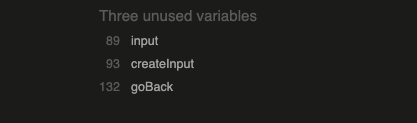
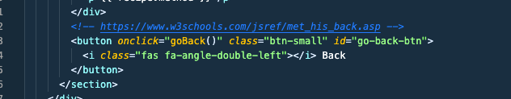
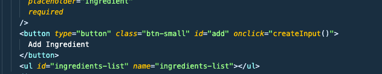

# Testing

## Contents

- [Validator Testing](#validator-testing)
- [LightHouse Testing](#lighthouse-testing)
- [Testing for user strories](#testing-for-user-stories)
- [Manually Testing](#manually-testing)
- [Responsiveness Testing](#responsiveness-testing)
- [Bugs and solutions](#bugs-and-solutions)

## **Validator Testing**

### **HTML**

I used [W3C Markup Validation Service](https://jigsaw.w3.org/css-validator/) to test my html code.

Because the code is written using Jinja templates, I had to use "view page source" code by right clicking each live page, and run that code through the validator.

I got the following errors :

I fixed this error by replace the `` element with li, and add custom css to style it.

I fixed this error by adding an alt attribute to all `` element.

This is an error due to Jinjia templates, the loop caused duplicated id.

### **CSS**

I have used the W3C CSS Validation Service to validate my CSS code. An error was found see below. ⬇️

I fixed this error by using margin instead of margin-block.

The result came back clear! ⬇️

### **Javascript**

I used [JSHint](https://jshint.com/) to validate my Javascript code. I have got three unused variables, see the error message below. ⬇️

I checked them, `input`are unnessary, so I deleted it.

The "goBack" function are used in HTML as onlick method. See below ⬇️

The same issue for the creatInput function, it has been called in HTML code. See below ⬇️

### **Python**

I checked my app.py file using [PEP8 online](http://pep8online.com/checkresult), errors shows below ⬇️

In order to fix the errors, I had to disable Pylance.

## **LightHouse Testing**

After validating all codes, I ran the site through Chrome LightHouse. The initial scores were below: ⬇️

Taking the feedback into account, I have looked into the recommedations and will bear it in mind for future project.
